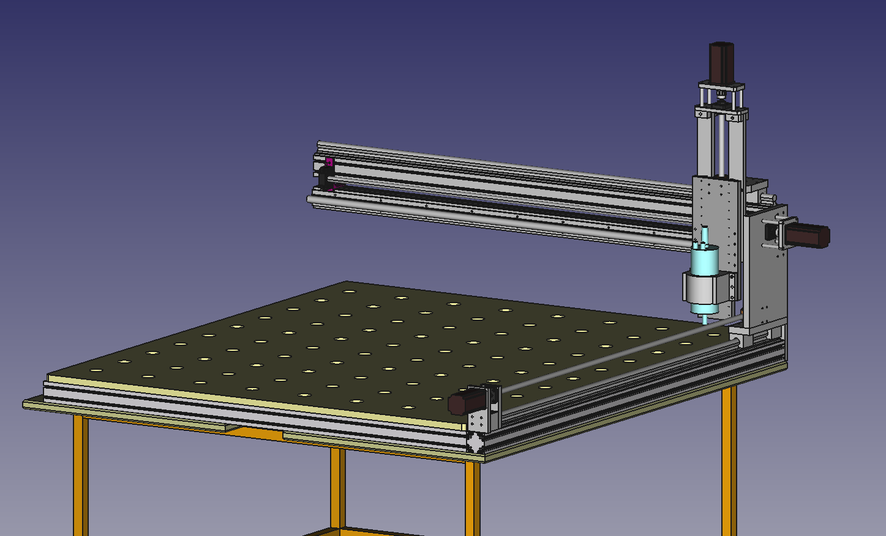

# The Next-Gen CNC

Collective project of the Base48 participants to develop and construct a bigger CNC router.

## How to contribute

Ideally come visit us at **Mojmírovo náměstí 17 in Brno, Czech republic** to discuss the design, implement changes and help with fabrication or formulate the proposal as an issue on GitHub to be easily understandable so that we can brainstorm it to decide whether it's a good idea to then be implemented.

If you are making changes to the design then make sure that you are using [Webtools-Git](https://wiki.freecad.org/WebTools_Git/en) and make small changes that are easy to review.

## Notes on FreeCAD

The project is managed using [A2plus workbench](https://wiki.freecad.org/A2plus_Workbench) to optimize the project on system resources utilization and programming complexity while making it possible to dedicate one FCStd file per part for reusability.
